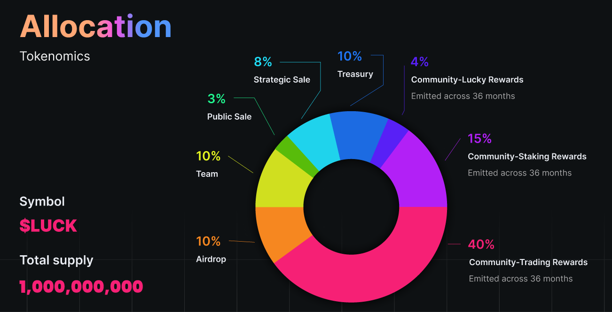

# Tokenomics

OpenLuck Token: **$LUCK**

Total Supply: **1,000,000,000**

Token Status**:  Unissued** (planning only)

## **Token Core Function**

* 50% of the net fees on OpenLuck will be distributed to $LUCK stakers .
* 20% of the net fees on OpenLuck go to a $LUCK buy/burn.
* Hold $LUCK to participate a limited governance of OpenLuckDAO
* Hold $LUCK to participate in the Exclusive and VIP features to be developed.

## **Token Ussage**

* Trading Rewards
* Staking Rewards
* Liquidity Rewards
* Lucky Rewards
* Stake $LUCK for Governance
* Stake $LUCK gets NFT AirDrops

